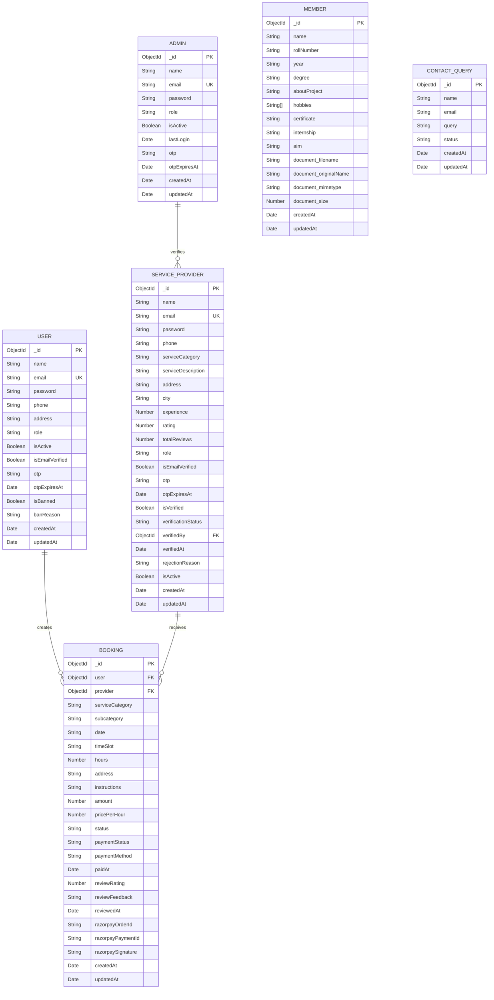

# UrbanEase ER Diagram

This ER diagram is based on the MongoDB/Mongoose models in `server/models`.

## ER Diagram

## Entities And Attributes

### User

Stores customer account details.

| Attribute | Type | Constraint / Purpose |
| --- | --- | --- |
| `_id` | ObjectId | Primary key |
| `name` | String | Required |
| `email` | String | Required, unique, lowercase |
| `password` | String | Required, minimum 6 characters, hashed before save |
| `phone` | String | Optional |
| `address` | String | Optional |
| `role` | String | Default: `user` |
| `isActive` | Boolean | Default: `true` |
| `isEmailVerified` | Boolean | Default: `false` |
| `otp` | String | Email verification OTP |
| `otpExpiresAt` | Date | OTP expiry time |
| `isBanned` | Boolean | Default: `false` |
| `banReason` | String | Reason for admin ban |
| `createdAt`, `updatedAt` | Date | Auto-managed timestamps |

### Admin

Stores administrator login and verification details.

| Attribute | Type | Constraint / Purpose |
| --- | --- | --- |
| `_id` | ObjectId | Primary key |
| `name` | String | Required |
| `email` | String | Required, unique, lowercase |
| `password` | String | Required, minimum 6 characters, hashed before save |
| `role` | String | Default: `admin` |
| `isActive` | Boolean | Default: `true` |
| `lastLogin` | Date | Last admin login time |
| `otp` | String | OTP value |
| `otpExpiresAt` | Date | OTP expiry time |
| `createdAt`, `updatedAt` | Date | Auto-managed timestamps |

### Service Provider

Stores service provider account, service, rating, and verification information.

| Attribute | Type | Constraint / Purpose |
| --- | --- | --- |
| `_id` | ObjectId | Primary key |
| `name` | String | Required |
| `email` | String | Required, unique, lowercase |
| `password` | String | Required, minimum 6 characters, hashed before save |
| `phone` | String | Required |
| `serviceCategory` | String | Required enum: Plumbing, Electrical, Cleaning, Carpentry, Painting, Appliance Repair, Pest Control, Gardening, Security, Other |
| `serviceDescription` | String | Optional |
| `address` | String | Required |
| `city` | String | Required |
| `experience` | Number | Default: `0` |
| `rating` | Number | Default: `0` |
| `totalReviews` | Number | Default: `0` |
| `role` | String | Default: `serviceProvider` |
| `isEmailVerified` | Boolean | Default: `false` |
| `otp` | String | Email verification OTP |
| `otpExpiresAt` | Date | OTP expiry time |
| `isVerified` | Boolean | Default: `false` |
| `verificationStatus` | String | Enum: pending, approved, rejected |
| `verifiedBy` | ObjectId | Foreign key referencing `Admin._id` |
| `verifiedAt` | Date | Admin verification time |
| `rejectionReason` | String | Reason if rejected |
| `isActive` | Boolean | Default: `true` |
| `createdAt`, `updatedAt` | Date | Auto-managed timestamps |

### Booking

Stores service bookings, payment state, Razorpay references, and review details.

| Attribute | Type | Constraint / Purpose |
| --- | --- | --- |
| `_id` | ObjectId | Primary key |
| `user` | ObjectId | Required foreign key referencing `User._id` |
| `provider` | ObjectId | Required foreign key referencing `ServiceProvider._id` |
| `serviceCategory` | String | Required |
| `subcategory` | String | Optional |
| `date` | String | Required booking date |
| `timeSlot` | String | Required booking time slot |
| `hours` | Number | Default: `1` |
| `address` | String | Required service address |
| `instructions` | String | Optional user instructions |
| `amount` | Number | Required payment amount |
| `pricePerHour` | Number | Default: `299` |
| `status` | String | Enum: pending, confirmed, completed, cancelled |
| `paymentStatus` | String | Enum: pending, paid |
| `paymentMethod` | String | Enum: upi, card, cash, empty |
| `paidAt` | Date | Payment completion time |
| `reviewRating` | Number | Optional, min 1, max 5 |
| `reviewFeedback` | String | Optional, max 1000 characters |
| `reviewedAt` | Date | Review submission time |
| `razorpayOrderId` | String | Razorpay order reference |
| `razorpayPaymentId` | String | Razorpay payment reference |
| `razorpaySignature` | String | Razorpay signature for verification |
| `createdAt`, `updatedAt` | Date | Auto-managed timestamps |

### Member

Stores project team member details displayed in the application.

| Attribute | Type | Constraint / Purpose |
| --- | --- | --- |
| `_id` | ObjectId | Primary key |
| `name` | String | Required |
| `rollNumber` | String | Required |
| `year` | String | Required |
| `degree` | String | Required |
| `aboutProject` | String | Required |
| `hobbies` | String array | Optional list |
| `certificate` | String | Optional |
| `internship` | String | Optional |
| `aim` | String | Required |
| `document.filename` | String | Uploaded document filename |
| `document.originalName` | String | Original uploaded file name |
| `document.mimetype` | String | Uploaded file MIME type |
| `document.size` | Number | Uploaded file size |
| `createdAt`, `updatedAt` | Date | Auto-managed timestamps |

### Contact Query

Stores contact form queries submitted by visitors or users.

| Attribute | Type | Constraint / Purpose |
| --- | --- | --- |
| `_id` | ObjectId | Primary key |
| `name` | String | Required |
| `email` | String | Required, lowercase |
| `query` | String | Required message/query |
| `status` | String | Enum: new, replied |
| `createdAt`, `updatedAt` | Date | Auto-managed timestamps |

## Relationships

| Relationship | Cardinality | Description |
| --- | --- | --- |
| User to Booking | One-to-many | One user can create many bookings. Each booking belongs to exactly one user. |
| Service Provider to Booking | One-to-many | One service provider can receive many bookings. Each booking is assigned to exactly one provider. |
| Admin to Service Provider | One-to-many | One admin can verify many service providers. A provider may be verified by one admin. |

## Notes

- MongoDB automatically creates `_id` for each document.
- `createdAt` and `updatedAt` are generated by Mongoose because every schema uses `{ timestamps: true }`.
- `Member` and `ContactQuery` are standalone collections in the current schema and do not reference other collections.
- Payment information is stored inside `Booking`; there is no separate `Payment` collection in the current backend models.
